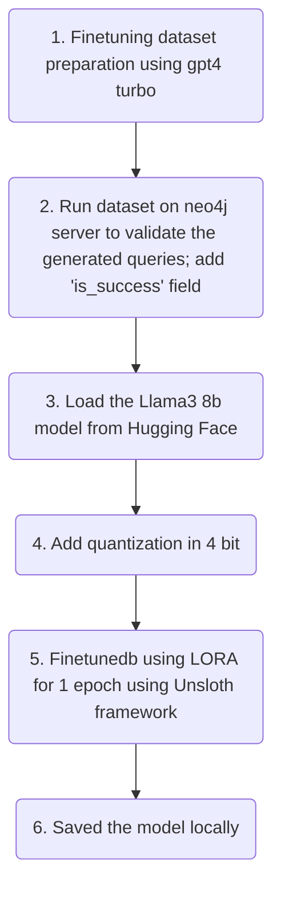

# FinetuningTextToCypher
This is a demo project where I have finetuned Llama3 8b model quantized in 4bit

I have Unsloth framework for finetuning the Llama3 8B model.

Total memory usage:

Future steps:
-[X] Convert the model to gguf format
-[] Load the model in LMStudio
-[] Experimentation of loading the model in mobile device
-[] Ran it locally for Cypher generation

